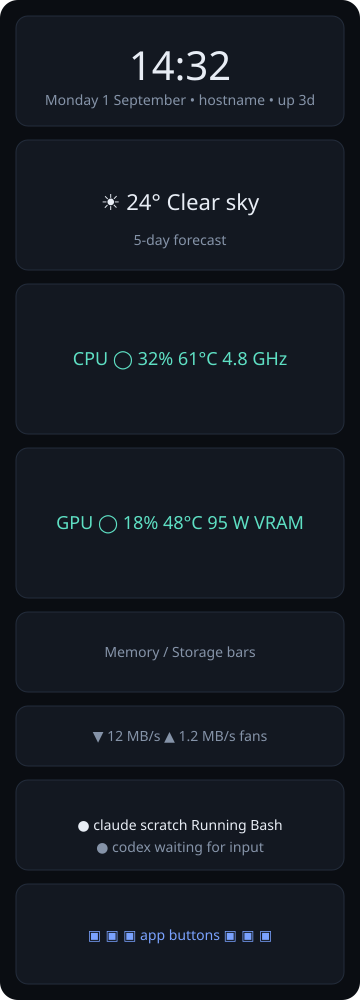

# hyte-panel

A touch panel dashboard for the **HYTE Y70 Touch** case screen on
**Ubuntu 26.04** with NVIDIA drivers.

The panel is a local web app. A small Python server reads the hardware and
serves the page. A kiosk window shows the page full screen on the HYTE screen.



## Widgets

- **Clock** with date, hostname and uptime.
- **Weather** from Open-Meteo. No API key. Current conditions and a 5-day strip.
- **CPU** usage ring, temperature, clock, load, per-core bars and a history graph.
- **GPU** (NVIDIA) usage ring, temperature, power, clock, fan, VRAM and a history graph.
- **Memory** and **storage** bars.
- **Network** throughput and case fan speeds.
- **AI agents** monitor. Shows Claude Code, Codex, Aider and other agent CLIs with
  a live status: working, waiting, needs attention, idle, ended.
- **Automata**. A cellular automata playground: Life-like rules, Brian's
  Brain, Wolfram's elementary rules and cyclic automata on the GPU. Paint with a
  finger, hold to stamp a glider gun. Idle, it rotates rules on its own; CPU
  load, network traffic and agent activity feed the world. Colors follow the
  lighting theme. Module in `hyte_panel/static/ca/`, dev page and tests in
  [automata/](automata/README.md).
- **App buttons** (config and launch endpoint kept; the card is currently
  replaced by the automata card).
- **Lighting-matched theme**. Accent colors track the rgb-runway Base and Stripe
  colors and switch live when they change.

## Requirements

- Ubuntu 24.04 or 26.04. GNOME on Wayland or X11.
- Python 3.11 or newer.
- NVIDIA driver with `nvidia-smi` (for GPU data).
- For the kiosk window: `python3-gi`, `gir1.2-gtk-4.0`, `gir1.2-webkit-6.0`,
  or a Chromium/Chrome browser as a fallback.

## Install on your machine

Follow these steps on the Ubuntu PC that has the HYTE Y70 Touch. Each step
shows the command and how to check the result.

### 1. Get the code

```bash
git clone https://github.com/zaclanzon/hyte-y70-panel.git ~/src/hyte-y70-panel
cd ~/src/hyte-y70-panel
```

### 2. Check the display and the driver

```bash
nvidia-smi                       # must list your GPU
echo $XDG_SESSION_TYPE           # wayland or x11
xrandr --query | grep connected  # X11 only: the HYTE screen shows as 2560x720
```

If `nvidia-smi` fails, install the driver first: `sudo ubuntu-drivers install`,
then reboot.

### 3. Run the installer

```bash
scripts/install-ubuntu.sh
```

The script asks for `sudo` once. It installs GTK4, WebKitGTK, PyGObject and
lm-sensors, creates a virtualenv in `~/.local/share/hyte-panel/venv`, writes
`~/.config/hyte-panel/config.toml` and enables the `hyte-panel` systemd user
service. It does not start the service.

Check: `~/.local/share/hyte-panel/venv/bin/hyte-panel show-config` prints the
config path and the app list.

### 4. Rotate the HYTE screen to portrait

1. Open Settings > Displays.
2. Select the 2560 x 720 monitor.
3. Set Orientation to "Portrait Right". If the image is upside down, use
   "Portrait Left".
4. Click Apply, then Keep Changes.

Check: the HYTE screen shows the desktop upright. GNOME writes
`~/.config/monitors.xml`. See [docs/hyte-y70-ubuntu.md](docs/hyte-y70-ubuntu.md)
for the X11 command line.

### 5. Map the touch sensor to the HYTE screen

```bash
scripts/map-touch.sh              # auto-detect
scripts/map-touch.sh DP-3         # or give the connector name from step 2
```

Check: touch the HYTE screen. The pointer moves on the HYTE screen, not on the
main monitor.

### 6. Edit the config

```bash
nano ~/.config/hyte-panel/config.toml
```

- Set `weather.label`, `weather.latitude` and `weather.longitude`.
- Set `display.connector` if the panel opens on the wrong monitor.
- Add or remove `[[apps]]` blocks. Find desktop ids with
  `ls /usr/share/applications ~/.local/share/applications /var/lib/snapd/desktop/applications`.
- Set `hardware.disks` to the mount points you want to see.

### 7. Start the panel

```bash
systemctl --user start hyte-panel
systemctl --user status hyte-panel
journalctl --user -u hyte-panel -f       # live log
```

Check: the panel fills the HYTE screen. The footer shows a green "live" dot.
Open `http://127.0.0.1:8787` in a browser to see the same page.

If the window does not open, import the session variables and restart:

```bash
systemctl --user import-environment DISPLAY WAYLAND_DISPLAY XDG_SESSION_TYPE
systemctl --user restart hyte-panel
```

### 8. Connect Claude Code

Copy the `hooks` block from
[examples/claude-code-hooks.json](examples/claude-code-hooks.json) into
`~/.claude/settings.json`. If the file already has a `hooks` block, merge the
entries. Start a Claude Code session. The AI agents card shows it within a
few seconds.

Check: `curl -s http://127.0.0.1:8787/api/agents` lists the session.

### 9. Keep the screen on

Set Settings > Power > Screen Blank to "Never", or set
`display.dim_after_seconds` in the config to dim only the panel.

### Update later

```bash
cd ~/src/hyte-y70-panel && git pull
~/.local/share/hyte-panel/venv/bin/pip install --quiet ".[nvidia]"
systemctl --user restart hyte-panel
```

### Uninstall

```bash
systemctl --user disable --now hyte-panel
rm -rf ~/.local/share/hyte-panel ~/.config/hyte-panel ~/.config/systemd/user/hyte-panel.service
```

## Run by hand

```bash
python3 -m venv --system-site-packages .venv
.venv/bin/pip install -e ".[nvidia,dev]"
.venv/bin/hyte-panel run            # server + kiosk window
.venv/bin/hyte-panel serve          # server only, open http://127.0.0.1:8787 in a browser
.venv/bin/hyte-panel show-config    # print the effective config
```

Open `http://127.0.0.1:8787` in any browser to preview the panel. Use the
device toolbar in the browser at 720 x 2560 to see the portrait layout.

## Configure

The config file is `~/.config/hyte-panel/config.toml`. Start from
[config.example.toml](config.example.toml). Key settings:

| Section | Setting | Purpose |
|---|---|---|
| `display` | `width`, `height` | Screen size. Y70 Touch: 720 x 2560. Infinite: 1100 x 3840. |
| `display` | `connector` | Force a monitor, for example `"DP-3"`. Empty = match by size. |
| `display` | `backend` | `auto`, `gtk` or `chromium`. |
| `display` | `dim_after_seconds` | Dim the panel after idle time. Touch wakes it. |
| `weather` | `latitude`, `longitude`, `units` | Location and unit system. |
| `hardware` | `disks`, `network_interface` | Mount points to show. Interface to graph. |
| `agents` | `process_patterns` | Executable names that count as agents. |
| `theme` | `follow_runway`, `runway_config` | Accent colors follow the rgb-runway `base_color` and `stripe_color`; warnings use their blend. |
| `automata` | `enabled`, `rule`, `cell`, `attract_idle_seconds`, `attract_rotate_seconds`, `reactive` | Automata card: starting rule, cell size in pixels, idle time before rules rotate, hardware reactivity. |
| `[[apps]]` | `desktop_id` or `command` | One block per button. |

Only apps from the config can start. The page cannot run arbitrary commands.
Keep `server.host` at `127.0.0.1`.

## Monitor AI agents

The panel finds agents in two ways.

**Process scan.** The server looks for running executables named in
`agents.process_patterns` (default: claude, codex, aider, gemini, cursor-agent,
copilot, goose). It shows the working directory, CPU and memory.

**Hook events.** Claude Code can post its hook payload to the panel. Then the
panel shows the real state: thinking, running a tool, waiting for input, or
waiting for a permission. Copy the `hooks` block from
[examples/claude-code-hooks.json](examples/claude-code-hooks.json) into
`~/.claude/settings.json`.

Any script can report a status too:

```bash
examples/report-status.sh nightly-build working "Compiling"
examples/report-status.sh nightly-build ended   "Build passed"
```

Or with curl:

```bash
curl -X POST http://127.0.0.1:8787/api/agents/status \
  -H 'Content-Type: application/json' \
  -d '{"id":"my-agent","name":"My agent","status":"attention","detail":"Needs approval"}'
```

## API

| Method | Path | Purpose |
|---|---|---|
| GET | `/api/config` | Public config: apps, display, weather label. |
| GET | `/api/snapshot` | One reading of all hardware, weather and agents. |
| GET | `/api/weather?refresh=1` | Weather; `refresh=1` forces a fetch. |
| GET | `/api/agents` | Agent list. |
| GET | `/api/theme` | Accent colors derived from the rgb-runway config. |
| POST | `/api/agents/hook` | Claude Code hook payload (JSON on stdin). |
| POST | `/api/agents/status` | Generic status: `{id, name, status, detail, cwd}`. |
| DELETE | `/api/agents/{id}` | Remove a hook-reported agent. |
| POST | `/api/launch/{index}` | Start app button `index`. |
| WS | `/ws` | Push stream: `config`, `snapshot` and `agent` messages. |

## Layout

```
hyte_panel/
  __main__.py          CLI: run | serve | window | show-config
  config.py            TOML config and defaults
  server.py            FastAPI app, WebSocket stream, launch endpoint
  window.py            GTK4/WebKit kiosk window, Chromium fallback
  launcher.py          Starts app buttons (gtk-launch or command)
  collectors/
    system.py          CPU, memory, disks, network, sensors (psutil)
    gpu.py             NVIDIA via NVML or nvidia-smi
    weather.py         Open-Meteo client
    agents.py          Agent registry: hook events + process scan
  static/              index.html, style.css, app.js
  static/ca/           automata module (core.js, ca.js, ca.css)
automata/              automata dev page, tests and notes
scripts/               install-ubuntu.sh, map-touch.sh
systemd/               user service unit
examples/              Claude Code hooks, report-status.sh
docs/                  Ubuntu + HYTE setup notes
tests/                 pytest suite
```

## Test

```bash
.venv/bin/pytest
```

## License

MIT. See [LICENSE](LICENSE).
